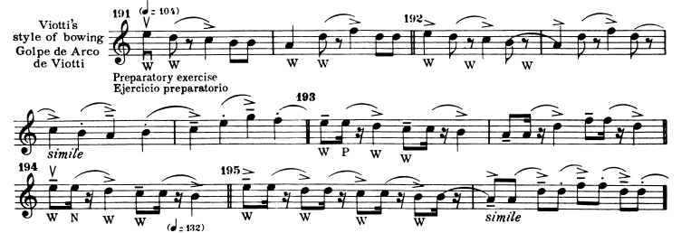
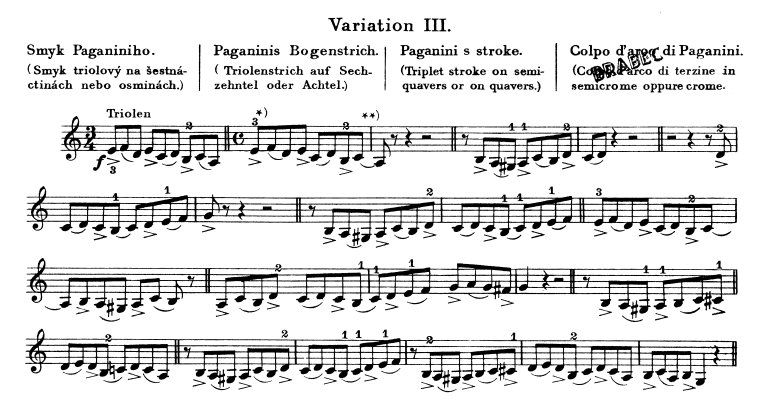

# 🎻 
# 🎼 Violin Schools by Region

- This README likely introduces major violin traditions across different countries, highlighting influential figures who shaped each style.
## 🇮🇹 Italian School

 *  Corelli, Tartini, Vivaldi, Paganini Pioneers of virtuosic technique and expressive phrasing. Paganini especially revolutionized violin playing with dazzling showmanship.

 ### 🇫🇷 French School

   * Viotti, Kreutzer, Baÿeux Focused on elegance, clarity, and refined bowing techniques. Viotti bridged Italian and French styles, influencing later conservatory traditions.

### 🇩🇪 German School

    ( includes figures like Joachim or Spohr) 

#### 🇷🇺 Russian School

 -   Heifetz Represents technical brilliance and emotional intensity. Russian training emphasizes discipline and dramatic interpretation.

 -   Tu écris une partition  avec les cordes g d a e   Et le rythme. 

 -   Tu vas dans les  partition violin tu écris school école ou schule

   - imslp org wiki Category For_violin

    french violin school wiki imslp

    Italian violin school wiki imslp

    Russian violin school wiki imslp

    achool jnterpretation violin
    - italian school violin -"violin making" -"violin maker"

    Gems de Paganini 

    nel cor più non mi sento Par Paganini 

    Nom d’un composer dans le titre un nom d’un autre composer 
    - connect to violin school from different countries
    - connect to violin concurso in different countries
    - italian school violin composer -"violin making" -"violin maker" -"violin makers"
    - german violin school composer -"violin making" -"violin maker" -"violin makers"
    - renowned violin pedagogue, and composer
    - important violin educators
    * bdd ou llm ; pays ont des composer, composer ont pieces (tempo, mesure, rythmne quil y a souvent),
    - interpretation : auer, sevcik,
    - italian violin style Bowing eight note
    - 
    - italian violin style Bowing downbow
    - italian violin style Bowing slurs
- german violin playing style half eigth quarter bow (mozart violin book)
- german violin playing style (carl flesch art of violin book) (SOME POINTS OF
VIOLIN PLAYING AND MUSICAL PERFORMANCE as learnt in the Hochschulefiir Musik (Joachim School) 
  - french violin playing style composer (viotti pierre baillot mazas)
  - french theory of violin playing methodological publications
- french theory of violin playing methodological publications upbow
- -  

- 

- orchestrationresources.com/. /chapter-7-bowing-for-all-strings

   - ://orch.info/ _5.34_Bowings_-How_to_Bow_an_Orchestral_Part
